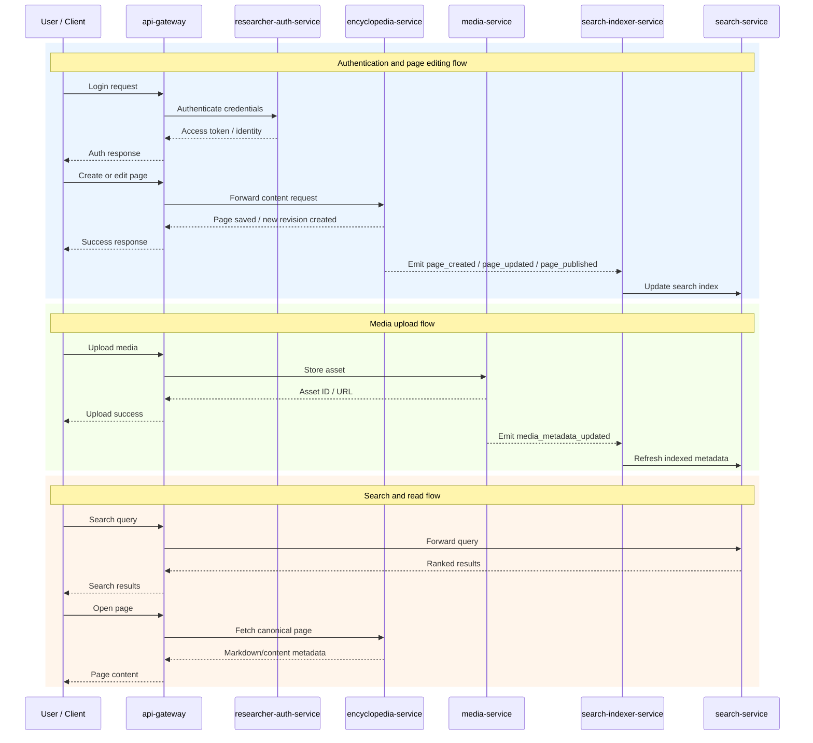

# Anomalious WIKI

Authors: [Sen Ivan](https://github.com/senivan), [Shevhcuk Ivan](https://github.com/DoktorTomato), [Bykov Danylo](https://github.com/DanyaBykov), [Dzoban Maksym](https://github.com/MaxDzioban)

## Premise

There are a lot dangers inside the Chornobyl exclusion zone. A lot of them are not yet explained nor can be easily percieved by human mind. Thus a lot researchers and regular stalkers try to explain fenomenan seen inside the zone. This project aims to become the main source of data for stalkers and scientists alike to discover all the possible dangers before delving into the zone. Furthermore, if someone found new anomalies not yet seen before, this someone can the data he found, so that new stalkers are prepared for their raids.

## Vision

We want to create a web app that acts as interactive encyclopedia for the fictional world of S.T.A.L.K.E.R. This app can be used as base for different worlds and purposes (just like wikipedia). 

This kind of tool can be used for gamers that interact with the world ingame, or for creators and users of different kinds of tabletop game systems. 

## Architecture (more in [docs/MICROSERVICE_ARCH.md](docs/MICROSERVICE_ARCH.md))

The project consists of 5 main microservices, which are:
- `encyclopedia-service` is the source of truth for pages and revisions
- `search-service` serves search
- `search-indexer-service` builds searchable representations from encyclopedia and media events
- `media-service` owns binary assets and their metadata
- `api-gateway` is the single entry point for clients

The encyclopedia-service acts as the authoritative source of truth for all knowledge records, while the media-service independently manages binary assets. These services work together through an event-driven workflow where the search-indexer-service asynchronously captures content changes to update the search-service, enabling high-performance discovery without impacting the responsiveness of editing operations. All client interactions are securely orchestrated through a centralized api-gateway that coordinates with the researcher-auth-service to enforce granular access controls across the platform.

Helpful diagram:

