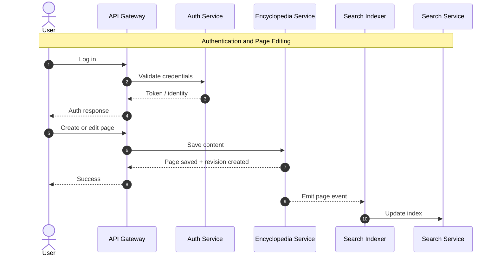
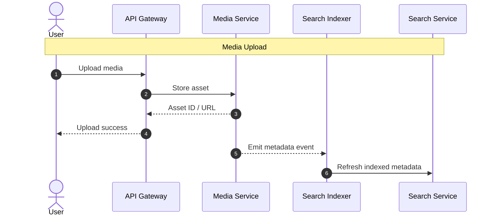
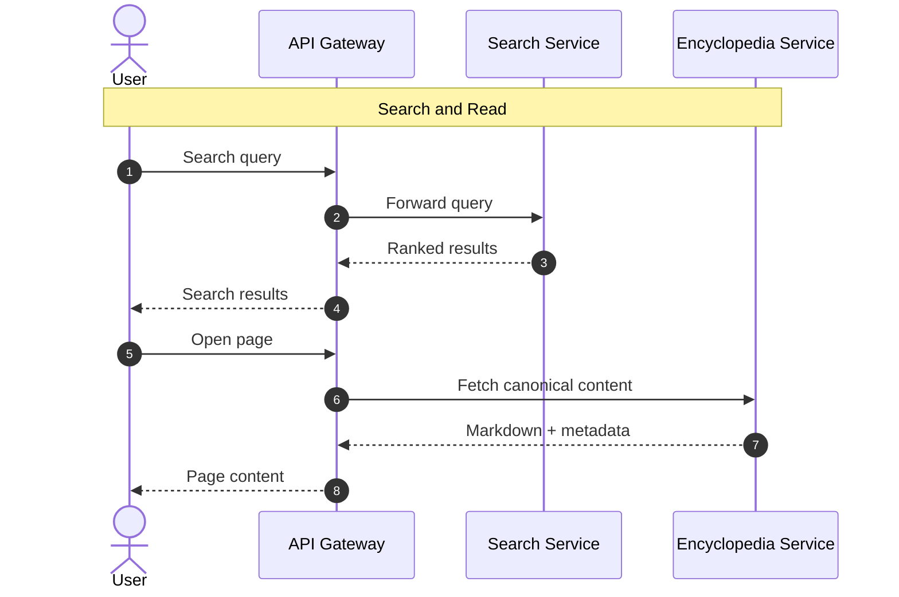
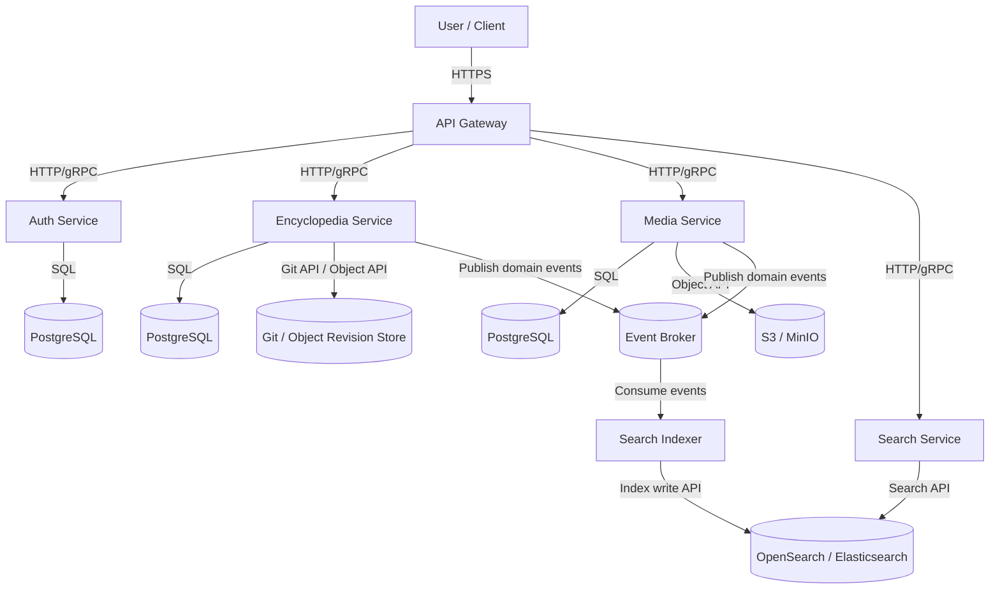

# Microsercive Architecture description for ANOMALY-WIKI project

## Overview

This system is an interactive encyclopedia for a fictional research organization operating in the Zone of the S.T.A.L.K.E.R. universe. It stores and serves structured knowledge about anomalies, artifacts, locations, incidents, expeditions, and other research records.

The system supports:
- public browsing of approved encyclopedia content
- authenticated researcher access to internal records and editing features
- Markdown-based page content with revision history
- search across published knowledge
- media attachments such as images, documents, maps, and audio records

The main design goals are:
- clear service boundaries
- separation of source-of-truth content from derived search indexes
- support for versioned editing and publication workflow
- ability to expose both public and internal views of the knowledge base

Core principles:
- `encyclopedia-service` is the source of truth for pages and revisions
- `search-service` serves search
- `search-indexer-service` builds searchable representations from encyclopedia and media events
- `media-service` owns binary assets and their metadata
- `api-gateway` is the single entry point for clients

---

## api-gateway

The `api-gateway` is the single external entry point for web clients and any public-facing consumers. It routes requests to internal services and applies common edge concerns before requests reach the domain services.

### Responsibilities
- route incoming API requests to internal services
- validate authentication tokens for protected endpoints
- enforce access rules between public and internal APIs
- apply rate limiting and request throttling
- centralize CORS, logging, request tracing, and error normalization

### Why it exists
Without a gateway, every client would need to know about every internal service directly, which increases coupling and complexity. The gateway abstracts away the internal service structure and allows for consistent handling of cross-cutting concerns.

### Main interactions
- forwards login and identity-related requests to `researcher-auth-service`
- forwards content read/write requests to `encyclopedia-service`
- forwards search requests to `search-service`
- forwards upload/media retrieval requests to `media-service`

---

## researcher-auth-service

The `researcher-auth-service` manages identity, authentication, and authorization for the system. It determines who a user is and what they are allowed to access or modify.

### Responsibilities
- user registration and researcher account management
- login and logout flows
- token issuance and validation
- password hashing and credential management
- role and permission management
- support for internal access levels such as public reader, researcher, editor, and administrator

### Owned data
This service owns:
- user accounts
- credentials
- roles
- permissions

### Example roles
- `public/unauthenticated` - can access only public content
- `researcher` - can read internal material and create drafts
- `editor` - can review and publish content
- `admin` - can manage users and system-level permissions

### Main API responsibilities
- authenticate user credentials
- issue access tokens
- return current user identity and role information
- validate permissions for specific actions

---

## encyclopedia-service

The `encyclopedia-service` is the core domain service of the system. It stores the encyclopedia’s pages, metadata, revision history, relationships, and publication state.

### Responsibilities
- create, read, update, and manage encyclopedia pages
- store Markdown page bodies as the canonical content format
- maintain immutable revision history for each page
- support draft, review, published, archived, and redacted states
- manage page relationships such as linked anomalies, related incidents, referenced expeditions, and attached media
- enforce business rules around editing and publishing

### Content model
A page is treated as a logical content record.

A page typically includes:
- page identifier
- slug
- title
- summary
- type
- visibility
- status
- current published revision
- current draft revision or user drafts
- tags or classifications
- links to related pages
- links to media assets

### Page types
Possible page types include:
- encyclopedia article
- anomaly dossier
- artifact record
- location file
- incident report
- expedition log
- researcher note

### Revision model
This service should support Git-like version control concepts

Recommended behavior:
- each edit creates a new immutable revision
- each revision stores parent revision reference
- published and draft revisions are tracked separately
- reverting creates a new revision instead of deleting history
- edit conflicts are handled using optimistic locking

### Owned data
This service owns:
- page metadata
- Markdown content
- revision history
- publication status
- page relationships
- links to media asset IDs

### Main events emitted
Examples:
- `page_created`
- `page_updated`
- `page_revision_created`
- `page_published`
- `page_archived`
- `page_deleted`

These events are consumed by `search-indexer-service` and potentially by other future services.

### Notes
- this is the main source of truth for content
- no other service should own canonical page bodies
- search indexes must be treated as derived data, not authoritative data

---

## search-service

The `search-service` provides the API used by clients to search the encyclopedia. It serves search results from an indexed search backend and is optimized for retrieval, filtering, ranking, and autocomplete.

### Responsibilities
- execute search queries over indexed content
- support full-text search across titles, summaries, and page bodies
- support filtering by page type, tags, visibility, classification, and status where appropriate
- provide autocomplete and query suggestions
- return ranked results with snippets and highlighted matches

### Main interactions
- receives search requests from `api-gateway`
- queries the indexed datastore populated by `search-indexer-service`
- returns ranked results to clients

### Example search capabilities
- keyword search
- filter by page type
- public-only search
- researcher/internal search
- autocomplete on titles and aliases
- snippet extraction for result previews

---

## search-indexer-service

The `search-indexer-service` is responsible for building and updating the search index from content owned by other services. It transforms source content into search-friendly documents.

### Responsibilities
- consume change events from `encyclopedia-service`
- optionally consume relevant metadata events from `media-service`
- extract searchable text from Markdown and structured metadata
- build and update documents in the search index
- maintain separate indexing rules for public and internal content if needed

### Why it exists
Index construction is a background data-processing concern. It should not slow down user-facing content editing or be tightly coupled to synchronous request flows.

### Input sources
This service consumes events such as:
- `page_created`
- `page_updated`
- `page_published`
- `page_deleted`
- `media_metadata_updated`

### Output
It writes derived search documents into the search backend used by `search-service`.

Indexed fields may include:
- title
- slug
- summary
- plain text extracted from Markdown
- tags
- page type
- aliases
- classification
- visibility
- related entity names

---

## media-service

The `media-service` manages binary assets and their metadata. It is responsible for storing uploaded files and exposing them safely to other services and clients.

### Responsibilities
- handle file uploads
- store media files in object storage or equivalent backend
- manage metadata for files
- provide stable asset identifiers
- generate public or signed URLs when needed
- support previews, thumbnails, and media lookup

### Supported media examples
- photographs
- map fragments
- scanned reports
- PDF documents
- audio logs
- image attachments for incidents or expeditions

### Owned data
This service owns:
- file metadata
- storage location references
- asset IDs
- MIME types
- file sizes
- optional preview or thumbnail references

### Main interactions
- clients upload media through `api-gateway` to `media-service`
- `encyclopedia-service` stores references to media asset IDs inside page content or metadata
- `search-indexer-service` may use media metadata for indexing

---

## Service Interaction Summary

1. a researcher authenticates through `researcher-auth-service`
2. the client sends a content update through `api-gateway`
3. `encyclopedia-service` stores a new revision of the page
4. `encyclopedia-service` emits a content change event
5. `search-indexer-service` consumes the event and updates the search index
6. `search-service` serves updated results for future queries
7. if the page contains assets, those are managed through `media-service`

A typical read/search flow looks like this:

1. the client sends a search query to `api-gateway`
2. the request is routed to `search-service`
3. `search-service` queries the search backend
4. the client receives ranked search results
5. when a result is opened, the client fetches canonical content from `encyclopedia-service`

---

## Architectural Notes

### Source of truth
- `encyclopedia-service` is the source of truth for pages
- `media-service` is the source of truth for assets
- `search-service` serves derived search views only

### Communication style
- synchronous HTTP for direct user operations
- asynchronous events for indexing and background propagation

### Storage direction
- relational database for page metadata and revisions
- object storage for media files
- search engine for indexed retrieval

